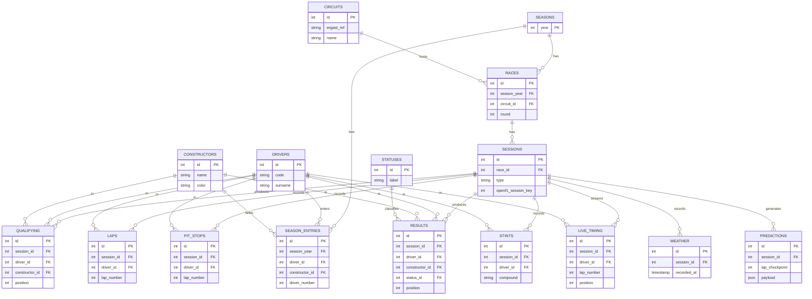

# F1 Analysis & Prediction Platform

Historical Formula 1 analysis and race-result prediction. React + TypeScript
frontend, FastAPI + PostgreSQL backend, and ML models that predict finishing
order. Portfolio project.

Full schema, ERD, and rationale: [`docs/F1_database_design_v2.pdf`](docs/F1_database_design_v2.pdf).

## Database

PostgreSQL, normalized (3NF) with JSONB where a document fits better. It bridges
two sources — Jolpica/Ergast (results & qualifying, 1950+) and OpenF1 (telemetry
& live timing, 2023+) — mirrored into our own DB rather than queried live, since
the free APIs are deprecated / rate-limited.



### Why PostgreSQL, not MongoDB

- The workload is relational and analytical — cross-season joins, aggregations,
  and foreign-key integrity across drivers, constructors, and sessions. SQL fits
  it directly; Mongo's `$lookup` is awkward for multi-way joins.
- The only places that want a flexible document — `predictions.payload` and the
  live race snapshot — are covered by Postgres JSONB. So we get document
  flexibility without a second datastore, on one Neon free-tier bill.

### `live_timing` is transient

- One row per driver per lap = the full running order at the end of each lap,
  streamed from OpenF1 during a race.
- The model reads the trailing ~10 laps at each checkpoint; rows for a session
  are deleted once its official `results` are ingested. It never feeds `results`
  (which is set only by the final classification).

## Stack

| Layer    | Choice                                       |
|----------|----------------------------------------------|
| Frontend | React + TypeScript (Vite), React Query, Recharts, Tailwind |
| Backend  | FastAPI, SQLAlchemy 2.0, Alembic (Python 3.13) |
| Database | PostgreSQL (local via Docker; Neon in prod)  |
| ML       | scikit-learn / LightGBM (trained offline)    |
| Hosting  | Cloudflare Pages + Render + Neon ($0/month)  |

## Run locally

```bash
docker compose up --build        # API on :8000, Postgres on :5432

cd backend
alembic upgrade head             # apply migrations
uvicorn app.main:app --reload

cd frontend && npm install && npm run dev   # http://localhost:5173
```